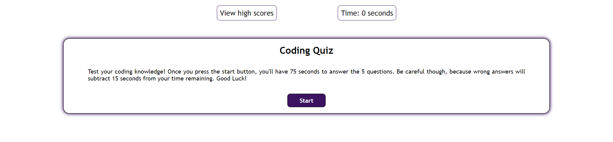
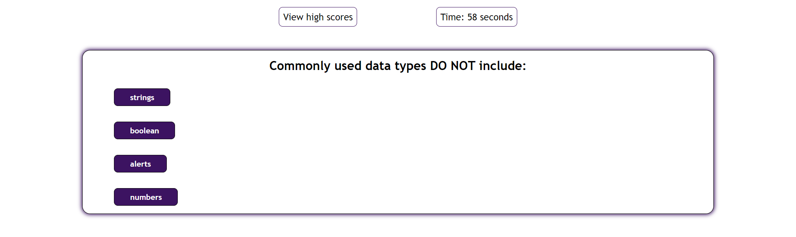
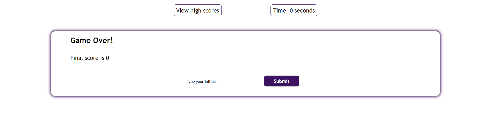
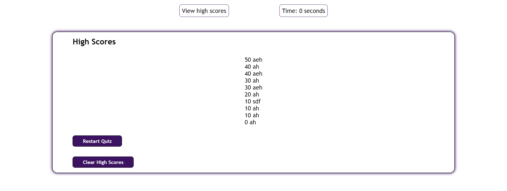

# Code Quiz

## Description

This is a coding quiz project for the UW Coding Bootcamp.  This page uses HTML, CSS, Javascript, and Web APIs to create a functioning quiz.

## Installation
Use a web browser to access the site:

https://andreahergert.github.io/codequiz/

## Usage
The user will be presented with 5 questions.  Each question is worth 10 points.  The initial start timer gives the user 75 seconds to answer.  However, if an answer is selected as wrong, then the user will lose 15 seconds.  If the timer reaches 0 before the 5 questions are answered, then the quiz will end and the user will be presented with their points.

Screenshots of website:

The user clicks on the Start button:

The user will be presented with 5 questions:

The user will be able to see their score at the end of the quiz and input their initials into the box:

The user will be able to view the 10 or fewer highest scores:

## License
MIT License